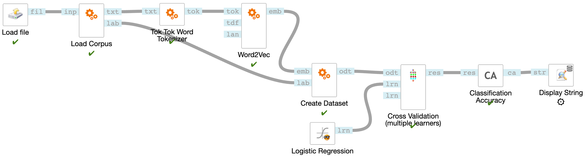

# cf_text_embeddings



This is a [ClowdFlows 3.0](https://github.com/xflows/clowdflows-backend) package which contains widgets for word, sentence and document embeddings.
See [Widgets](https://github.com/xflows/cf_text_embeddings/wiki/Widgets) to learn more about the included embeddings models.

## Installation
Install this package by running: `pip install cf_text_embeddings`.
To enable it in the ClowdFlows Backend, edit the `local_settings.py` file like shown below:
```
PACKAGE_TREE = [
    {
        "name": "Text Embeddings",
        "packages": ['cf_text_embeddings'],
        "order": 1
    }
]
```
Then run ` ./manage.py import_package cf_text_embeddings` from the ClowdFlows Backend directory to import widgets into the platform.

After package installation, you need to download the models.

## Download the models
The Text Embeddings package supports models for multiple languages. 
To list available languages: 

```python -m cf_text_embeddings.downloader -l```

To download all the models: 

```python -m cf_text_embeddings.downloader -d all```

You can also download the models for a specific language. For example, to download English models:

```python -m cf_text_embeddings.downloader -d en```.

## Usage
See [Usage](https://github.com/xflows/cf_text_embeddings/wiki/Usage) and [Widgets](https://github.com/xflows/cf_text_embeddings/wiki/Widgets) wikis.
